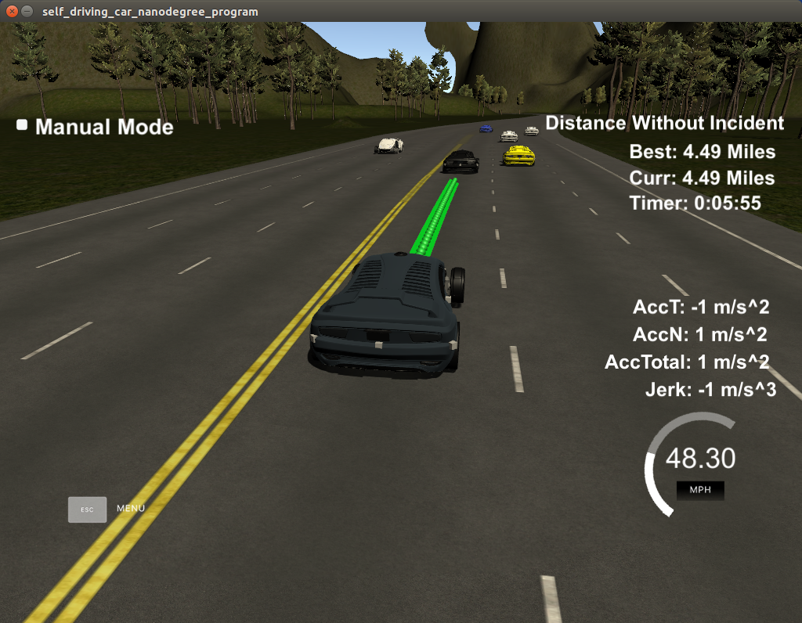

# CarND-Path-Planning-Project

### 1. Introduction
In this project your goal is to safely navigate around a virtual highway with other traffic that is driving +-10 MPH of the 50 MPH speed limit. You will be provided the car's localization and sensor fusion data, there is also a sparse map list of waypoints around the highway. The car should try to go as close as possible to the 50 MPH speed limit, which means passing slower traffic when possible, note that other cars will try to change lanes too. The car should avoid hitting other cars at all cost as well as driving inside of the marked road lanes at all times, unless going from one lane to another. The car should be able to make one complete loop around the 6946m highway. Since the car is trying to go 50 MPH, it should take a little over 5 minutes to complete 1 loop. Also the car should not experience total acceleration over 10 m/s^2 and jerk that is greater than 50 m/s^3.

### 2. The map of the highway is in data/highway_map.txt
Each waypoint in the list contains  [x,y,s,dx,dy] values. x and y are the waypoint's map coordinate position, the s value is the distance along the road to get to that waypoint in meters, the dx and dy values define the unit normal vector pointing outward of the highway loop.

The highway's waypoints loop around so the frenet s value, distance along the road, goes from 0 to 6945.554.

### 3. Basic Build InstructionsTo meet specifications for this rubric it is necessary to discuss the method used for generating paths, and the lane changing decision making process, in detail. We want to see a clear and detailed description of the lane changing methodology.

Additional details on the methodology employed when approaching slower traffic is also needed..

requirement

Please have this included in the next submission.

1. Clone this repo.
2. Make a build directory: `mkdir build && cd build`
3. Compile: `cmake .. && make`
4. Run it: `./path_planning`.

Here is the data provided from the Simulator to the C++ Program

### Main car's localization Data (No Noise)

["x"] The car's x position in map coordinates

["y"] The car's y position in map coordinates

["s"] The car's s position in frenet coordinates

["d"] The car's d position in frenet coordinates

["yaw"] The car's yaw angle in the map

["speed"] The car's speed in MPH

### 4. Previous path data given to the Planner

//Note: Return the previous list but with processed points removed, can be a nice tool to show how far along
the path has processed since last time. 

["previous_path_x"] The previous list of x points previously given to the simulator

["previous_path_y"] The previous list of y points previously given to the simulator

### 5. Previous path's end s and d values 

["end_path_s"] The previous list's last point's frenet s value

["end_path_d"] The previous list's last point's frenet d value

### 6. Sensor Fusion Data, a list of all other car's attributes on the same side of the road. (No Noise)

["sensor_fusion"] A 2d vector of cars and then that car's [car's unique ID, car's x position in map coordinates, car's y position in map coordinates, car's x velocity in m/s, car's y velocity in m/s, car's s position in frenet coordinates, car's d position in frenet coordinates. 

### 7. Details

1. The car uses a perfect controller and will visit every (x,y) point it recieves in the list every .02 seconds. The units for the (x,y) points are in meters and the spacing of the points determines the speed of the car. The vector going from a point to the next point in the list dictates the angle of the car. Acceleration both in the tangential and normal directions is measured along with the jerk, the rate of change of total Acceleration. The (x,y) point paths that the planner recieves should not have a total acceleration that goes over 10 m/s^2, also the jerk should not go over 50 m/s^3. (NOTE: As this is BETA, these requirements might change. Also currently jerk is over a .02 second interval, it would probably be better to average total acceleration over 1 second and measure jerk from that.

2. There will be some latency between the simulator running and the path planner returning a path, with optimized code usually its not very long maybe just 1-3 time steps. During this delay the simulator will continue using points that it was last given, because of this its a good idea to store the last points you have used so you can have a smooth transition. previous_path_x, and previous_path_y can be helpful for this transition since they show the last points given to the simulator controller with the processed points already removed. You would either return a path that extends this previous path or make sure to create a new path that has a smooth transition with this last path. 

### 8. Generating Paths

- Anchor Points For the Spline: I am using 5 anchor points to fit a spline. The first two points are the last and the second last points from the previous path points received from the simulator. If the previous path list has less than two points, than the ego car's current position and yaw is used to create the first point (yaw is used so that we generate the point tangent to car's current heading). The second points is the car's current position. The remaining three anchor points are placed at 30m, 60m and 90m in the s coordinate ahead of the car. Their corresponding d is caculated based on the lane the car wishes to be in. These three pairs of (s,d) coordinates are translated to xy coordinates using the 'getXY' function.

- Path Generation: The five anchor points generated as described above are used to fit a spline. 

- Smoothing: In each cycle 50 waypoints are sent to the simulator for the car to follow. To make a smooth transition between cycles, instead of generating new waypoints every time, the previous path points received from the simulator are used and only the deficit number of waypoints are generated.

### 9. Behavior Planning

First pass through the sensor data:
- The left lane is marked as safe if there are no vehicles within 30m in front and 30m behind the ego vehicle in the left lane.
- The right lane is marked as safe if there are no vehicles within 30m in front and 30m behind the ego vehicle in the right lane.
- If the ego vehicle is in the left most lane, than a left lane change is marked as unsafe.
- If the ego vehicle is in the right most lane, than a right lane change is marked as unsafe.

Second pass through the sensor data:
- Lane Change Decision: If the gap between the ego vehicle and the vehicle in front is less than the set threshold (30m) than the lane safety information from the first pass is used to determine the appropriate action (i.e., keep lane, change left or change right). 
- Handling Sudden Brake by Car in Front: Even though this works and the ego car is able to make safe lane changes, there were a few instances when the sudden braking by the vehicle in front resulted in a collision. To handle such situations I am maintaining a variable named "break_multiplier" which controls how aggressively the speed of the ego vehicle is reduced. (Refer to source code lines 309 to 314 in main.cpp)

The source code pertaining to the behavior planner implementation can be found between lines 248 and 351 in main.cpp.

### 10. Result

The following screenshot shows the ego vehicle completing one lap without incident.

